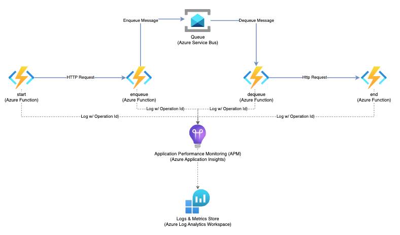

# Azure APM Application Insights Service end-to-end transactions:





## Functions

The code file defines an Azure Function App that consists of four functions that handle HTTP requests:  

***start***: This function is triggered by an HTTP request with the route /start. It logs the request and then makes a GET request to another endpoint with the same headers.  

***enqueue***: This function is triggered by an HTTP request with the route /enqueue. It logs the request and then sends a message to an Azure Service Bus queue.  

***dequeue***: This function is triggered by a message in an Azure Service Bus queue. It logs the message and then makes a POST request to another endpoint with the same headers.  

***end***: This function is triggered by an HTTP request with the route /end. It logs the request and returns a HTTP response with the body "END".  


## Trace Context


### The trace context standard
The [W3C Trace Context](https://www.w3.org/TR/trace-context/) specification defines a standard to HTTP headers and formats to propagate the distributed tracing context information. It defines two fields that should be propagated in the http request's header throughout the trace flow. Take a look below at the standard definition of each field:

* ***traceparent***: identifier responsible to describe the incoming request position in its trace graph. It represents a common format of the incoming request in a tracing system, understood by all vendors.

* ***tracestate***: extends traceparent with vendor-specific data represented by a set of name/value pairs. Storing information in tracestate is optional.

#### The ***traceparent*** field
The ***traceparent*** field uses the Augmented Backus-Naur Form (ABNF) notation of [RFC5234](https://www.w3.org/TR/trace-context/#bib-rfc5234) and is composed by 4 sub-fields:

```
# version - traceid - parentid/spanid - traceflags

00-480e22a2781fe54d992d878662248d94-b4b37b64bb3f6141-00
```

***version*** (8-bit): trace context version that the system has adopted. The current is 00.

***trace-id*** (16-byte array): the ID of the whole trace. It's used to identify a distributed trace globally through a system.

***parent-id*** / span-id (8-byte array): used to identify the parent of the current span on incoming requests or the current span on an outgoing request.

***trace-flags*** (8-bit): flags that represent recommendations of the caller. Can be also thought as the caller recommendations and are strict to three reasons: trust and abuse, bug in the caller or different load between caller and callee service.

> NOTE: all the fields are encoded as hexadecimal


---


***Redis UPGRADE*** Delete later
[Limitations](https://learn.microsoft.com/en-us/azure/azure-cache-for-redis/cache-how-to-upgrade)
Cache unavaiable for period - on basic tier
Old cached with dependency to Cloud Services - not supported
Upgrade from 4 to 6 must be test in duplicated env
[Misconfigurations](https://learn.microsoft.com/en-us/azure/azure-cache-for-redis/cache-how-to-premium-vnet#what-are-some-common-misconfiguration-issues-with-azure-cache-for-redis-and-virtual-networks)


# azure-application-insights-trace-id
python trace-id/operation-id correlation test


[Azure Service Bus output binding for Azure Functions](https://learn.microsoft.com/en-us/azure/azure-functions/functions-bindings-service-bus-output?tabs=python-v2%2Cisolated-process%2Cnodejs-v4%2Cextensionv5&pivots=programming-language-python)


[Tutorial: Use identity-based connections instead of secrets with triggers and bindings](https://learn.microsoft.com/en-us/azure/azure-functions/functions-identity-based-connections-tutorial-2)

[host.json settings](https://learn.microsoft.com/en-us/azure/azure-functions/functions-bindings-service-bus?tabs=isolated-process%2Cfunctionsv2%2Cextensionv3&pivots=programming-language-python#hostjson-settings)