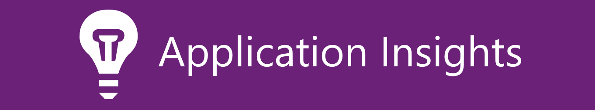
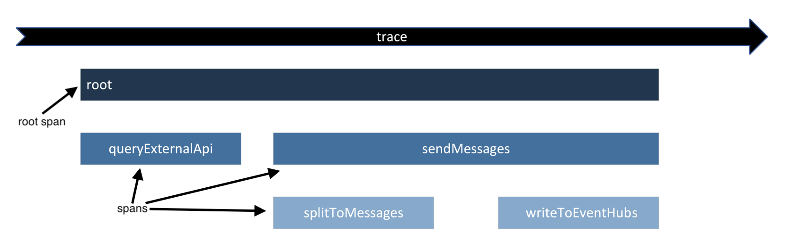
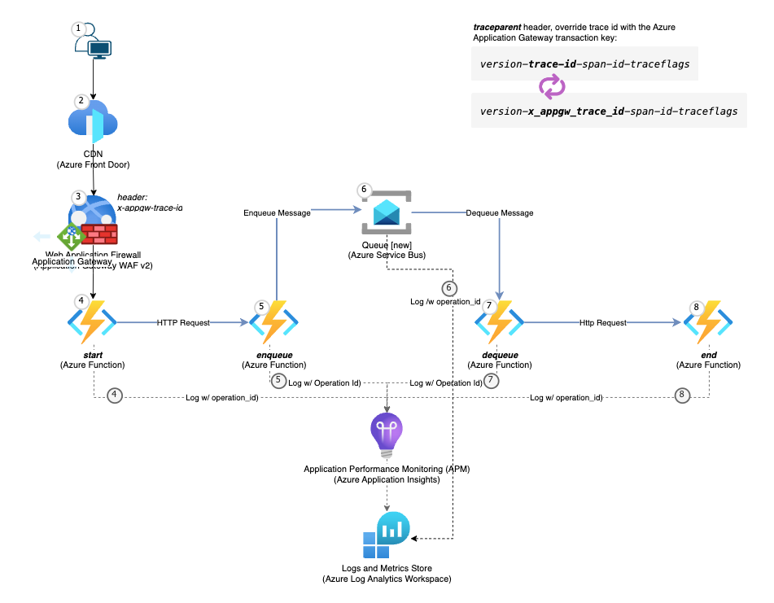
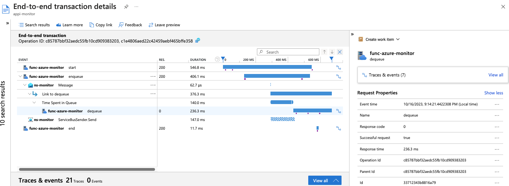

# Distributed tracing in action (a.k.a trace-context propagation)


## Distributed tracing  
In this architecture, **the system is a chain of microservices**. Each microservice can fail independently for various reasons. When that happens, it's important to understand what happened so you can troubleshoot. It’s helpful to isolate an end-to-end transaction and follow the journey through the app stack, which consists of services or microservices. This method is called ***distributed tracing***.  

***Tracing***, Tracing tracks the progression of a single user request as it is handled by other services that make up an application.  
Each unit work is called a ***span*** in a ***trace***. Spans include metadata about the work, including the time spent in the step (latency), status, time events, attributes, links. You can use tracing to debug errors and latency issues in your applications.  

***trace***, A ***trace*** is a tree of ***spans***. It is a collective of observable signals showing the path of work through a system. A ***trace*** on its own is distinguishable by a unique 16 byte sequence called a `trace-id`.

***span***, A span represents a single operation in a ***trace***. A span could be representative of an HTTP request, a remote procedure call (RPC), a database query, or even the path that a code takes in user code, etc. A ***span*** on its own is distinguishable by a unique 8 byte sequence called a `span-id` or `parent-id`.    

***traceparent*** header, The *traceparent* header is composed by 4 sub-fields:
`# version - trace-id - parent-id/span-id - traceflags`
`00-480e22a2781fe54d992d878662248d94-b4b37b64bb3f6141-00`




---


## Scenario  

Azure APM Application Insights Service end-to-end transactions


#### Azure Resources: 
Functions, Service Bus queue, Applciation Insights, and Log Analytics Workspace

***Azure Function Service***: Azure Functions is an event-driven, serverless compute platform that helps you develop more efficiently using the programming language of your choice. Focus on core business logic with the highest level of hardware abstraction.  

***Azure Service Bus queue service***: Queues offer First In, First Out (FIFO) message delivery to one or more competing consumers. That is, receivers typically receive and process messages in the order in which they were added to the queue. And, only one message consumer receives and processes each message.  

***Azure Monitor Application Insights***: Azure Monitor Application Insights, Application Performance Monitoring (APM) subsystem, a feature of Azure Monitor, excels in Application Performance Management (APM) for live web applications.  

***Azure Log Analytics Workspace***: A Log Analytics workspace is a unique environment for log data from Azure Monitor and other Azure services, such as Microsoft Sentinel and Application Insights. Each workspace has its own data repository and configuration but might combine data from multiple services.  





#### The Flow

The code file defines an Azure Function App that consists of four functions that handle both Service Bus queues and HTTP requests:  

***start***: This function is triggered by an HTTP request with the route /start. It logs the request and then makes a GET request to another endpoint with the same headers.  

***enqueue***: This function is triggered by an HTTP request with the route /enqueue. It logs the request and then sends a message to an Azure Service Bus queue.  

***dequeue***: This function is triggered by a message in an Azure Service Bus queue. It logs the message and then makes a POST request to another endpoint with the same headers.  

***end***: This function is triggered by an HTTP request with the route /end. It logs the request and returns a HTTP response with the body "END".  


#### End-to-end transaction view



---


## Test

##### Trace Headers
***traceparent***: `00-0af7651916cd43dd8448eb211c80319c-00f067aa0ba902b7-01`
***tracestate***: `rojo=00f067aa0ba902b7,congo=t61rcWkgMzE`

`https://<your-func>.azurewebsites.net`


---


## Trace Context W3C specification


> ***Distributed tracing*** is a methodology implemented by tracing tools to follow, analyze and debug a transaction across multiple software components. Typically, a [*distributed trace*](#distrace) traverses more than one component which requires it to be uniquely identifiable across all participating systems. Trace context propagation passes along this unique identification.


> <a name="distrace"></a> ***Distributed trace***, A distributed trace is a set of events, triggered as a result of a single logical operation, consolidated across various components of an application. A distributed trace contains events that cross process, network and security boundaries. A distributed trace may be initiated when someone presses a button to start an action on a website - in this example, the trace will represent calls made between the downstream services that handled the chain of requests initiated by this button being pressed.

### Abstract
This specification defines standard HTTP headers and a value format to propagate context information that enables **distributed tracing scenarios**. The specification standardizes how context information is sent and modified between services. Context information uniquely identifies individual requests in a distributed system and also defines a means to add and propagate provider-specific context information.


### The trace context standard
The [W3C Trace Context](https://www.w3.org/TR/trace-context/) specification defines a standard to HTTP headers and formats to propagate the distributed tracing context information. It defines two fields that should be propagated in the http request's header throughout the trace flow. Take a look below at the standard definition of each field:

* ***traceparent***: ***traceparent*** describes the position of the incoming request in its trace graph in a portable, fixed-length format. Its design focuses on fast parsing. Every tracing tool MUST properly set ***traceparent*** even when it only relies on vendor-specific information in tracestate


* ***tracestate***: extends traceparent with vendor-specific data represented by a set of name/value pairs. Storing information in tracestate is optional.

#### The ***traceparent*** field
The ***traceparent*** field uses the Augmented Backus-Naur Form (ABNF) notation of [RFC5234](https://www.w3.org/TR/trace-context/#bib-rfc5234) and is composed by 4 sub-fields:

```
# version - trace-id - parent-id/span-id - traceflags

00-480e22a2781fe54d992d878662248d94-b4b37b64bb3f6141-00
```

***version*** (8-bit): trace context version that the system has adopted. The current is 00.

***trace-id*** (16-byte array): the ID of the whole trace. It's used to identify a distributed trace globally through a system.

***parent-id*** or ***span-id*** (8-byte array): used to identify the parent of the current span on incoming requests or the current span on an outgoing request.

***trace-flags*** (8-bit): flags that represent recommendations of the caller. Can be also thought as the caller recommendations and are strict to three reasons: trust and abuse, bug in the caller or different load between caller and callee service.

> NOTE: all the fields are encoded as hexadecimal


---


## Further Reading

##### Microsoft learn

[Configure App Service with Application Gateway](https://learn.microsoft.com/en-us/azure/application-gateway/configure-web-app?tabs=defaultdomain%2Cazure-portal)
<sub>Application gateway allows you to have an App Service app or other multi-tenant service as a backend pool member. In this article, you learn to configure an App Service app with Application Gateway</sub>

[Application Insights overview](https://learn.microsoft.com/en-us/azure/azure-monitor/app/app-insights-overview)
<sub>Azure Monitor Application Insights, a feature of [Azure Monitor](https://learn.microsoft.com/en-us/azure/azure-monitor/overview), excels in Application Performance Management (APM) for live web applications.</sub>


[Azure Service Bus output binding for Azure Functions](https://learn.microsoft.com/en-us/azure/azure-functions/functions-bindings-service-bus-output?tabs=python-v2%2Cisolated-process%2Cnodejs-v4%2Cextensionv5&pivots=programming-language-python)


[Tutorial: Use identity-based connections instead of secrets with triggers and bindings](https://learn.microsoft.com/en-us/azure/azure-functions/functions-identity-based-connections-tutorial-2)

[host.json settings](https://learn.microsoft.com/en-us/azure/azure-functions/functions-bindings-service-bus?tabs=isolated-process%2Cfunctionsv2%2Cextensionv3&pivots=programming-language-python#hostjson-settings)

[Monitor a distributed system by using Application Insights and OpenCensus](https://learn.microsoft.com/en-us/azure/architecture/guide/devops/monitor-with-opencensus-application-insights)
<sub>This article describes a distributed system that's created with Azure Functions, Azure Event Hubs, and Azure Service Bus. It provides details about how to monitor the end-to-end system by using [OpenCensus for Python](https://github.com/census-instrumentation/opencensus-python) and Application Insights. This article also introduces distributed tracing and explains how it works by using Python code examples. The fictional company, Contoso, is used in the architecture to help describe the scenario.</sub>

[Log Analytics workspace overview](https://learn.microsoft.com/en-us/azure/azure-monitor/logs/log-analytics-workspace-overview)
<sub>A Log Analytics workspace is a unique environment for log data from Azure Monitor and other Azure services, such as Microsoft Sentinel and Microsoft Defender for Cloud. Each workspace has its own data repository and configuration but might combine data from multiple services.</sub>

[Azure Service Bus output binding for Azure Functions](https://learn.microsoft.com/en-us/azure/azure-functions/functions-bindings-service-bus-output?tabs=python-v2%2Cisolated-process%2Cnodejs-v4%2Cextensionv5&pivots=programming-language-python)


[Azure Functions Python developer guide](https://learn.microsoft.com/en-us/azure/azure-functions/functions-reference-python?tabs=asgi%2Capplication-level&pivots=python-mode-decorators)
<sub>This guide is an introduction to developing Azure Functions by using Python.</sub>

##### W3C  

[W3C Trace Context](https://www.w3.org/TR/trace-context/#trace-id)


##### Python and 3rd Party
[OpenCensus - Tracing](https://opencensus.io/tracing/)
<sub>Tracing tracks the progression of a single user request as it is handled by other services that make up an application.</sub>

[Monitor a distributed system by using Application Insights and OpenCensus](https://learn.microsoft.com/en-us/azure/architecture/guide/devops/monitor-with-opencensus-application-insights)
<sub>This article describes a distributed system that's created with Azure Functions, Azure Event Hubs, and Azure Service Bus. It provides details about how to monitor the end-to-end system by using [OpenCensus for Python](https://github.com/census-instrumentation/opencensus-python) and Application Insights. This article also introduces distributed tracing and explains how it works by using Python code examples. The fictional company, Contoso, is used in the architecture to help describe the scenario.</sub>

[OpenTelemetry Python](https://github.com/open-telemetry/opentelemetry-python)

[Lelis Dev - trace context](https://luizlelis.com/blog/tracecontext)
<sub>Using W3C Trace Context standard in distributed tracing</sub>


